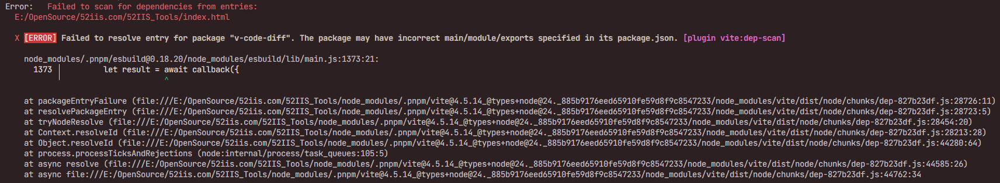

<div align="center">
  <h1>52IIS Tools</h1>
  <div style="margin-bottom: 20px;display: flex;justify-content: center;align-items: center;">
    <!-- <div align="left" style="width: 20%;text-align: right;">
      
    </div>
    <div align="right" style="width: 70%;margin-left: 20px;text-align: left;"> -->
      <p>只需简单几步，即可快速搭建属于自己的在线工具箱。</p>
      <p>本项目基于 <a href="https://github.com/naroat/tools-web" target="_blank">tools-web</a> 进行二次修改创作。</p>
      <p>本项目GitHub地址： <a href="https://github.com/52IIS/52IIS_Tools" target="_blank">https://github.com/52IIS/52IIS_Tools</a></p>
    <!-- </div> -->
  </div>

  [](https://nodejs.org/)  [](https://vuejs.org/)  [](https://tailwindcss.com/)  [](https://element-plus.org/)  [](LICENSE)

</div>

## 目录 📑

- [功能展示](#功能展示) 🎯
- [开始使用](#开始使用) 🚀
  - [手动部署](#手动部署) 💻
- [工具列表](#工具列表) 🛠️
- [其他](#其他) ❓

## 功能展示 🎯

在线站点：<a href="https://www.52iis.com" target="_blank">52IIS Tools</a>

## 开始使用 🚀


### 手动部署 💻

安装`pnpm`
```bash
npm install pnpm -g
```

克隆仓库 📥
```bash
git clone --depth=1 https://github.com/52IIS/52IIS_Tools.git
```

安装依赖 📦
```bash
# 进入项目
cd 52IIS_Tools

# 复制配置文件
cp .env.example .env.development

# 安装
pnpm install
```

启动开发服务器 🚀
```bash
pnpm dev
```

打包生产版本 📦
```bash
pnpm build
```

打包SEO静态页面 📄
```bash
# 复制配置文件并修改
cp .env.development .env.production
# 将.env.production中的NODE_ENV值改为production

# 运行打包命令
pnpm build:pro
```

## 工具列表 🛠️

### 开发运维 🔧
- 🔑 随机密码生成
- 🔗 URL编码/解码
- 🔢 UUID生成器
- ⏰ 时间戳转换
- 🔒 MD5在线加密/解密
- 📝 JSON在线转换
- 🔍 正则测试工具
- 🌐 Unicode转中文
- 📋 HTTP状态码
- 🔐 JWT解析
- 💻 HTML实体转义
- 📄 JS代码格式化/压缩
- 📄 HTML代码格式化
- 🎨 CSS代码格式化/压缩

### 文本处理 📝
- 🆚 文本对比
- ✏️ Markdown编辑器
- 🎨 ASCII字形生成器
- 🧹 文本去重
- 📄 在线文本编辑/HTML获取
- 🔢 字数统计

### 教育学术 🎓
- 🔄 单位换算
- 📡 摩斯电码
- 🔢 常用进制转换
- 📊 ASCII码表
- 📏 长度单位转换
- 📐 面积单位转换
- ⚖️ 重量单位转换
- ⏱️ 时间单位转换
- 🌡️ 温度单位转换
- 📊 压力单位转换
- 🔥 热量单位转换
- 💡 功率单位转换

### 图片处理 🖼️
- 📱 二维码生成
- 🎨 在线图片处理
- 📝 文本转图片
- ✂️ 图片分割

### 数据图表 📊
- 📊 柱状图
- 📈 折线图
- 🥧 饼图
- 🔍 散点图

### 选择随机 🎲
- 🔢 生成随机数
- 🤔 帮我决定
- 🪙 抛硬币
- 🎲 投骰子

### 其他工具 🎯
- 💰 数字转金额大写
- 📢 手持弹幕
- 🎨 色板
- 🎨 Color选择器
- 🎬 M3U8视频播放器
- 📄 PDF转图片
- 🖼️ Favicon在线制作
- 🎨 ASCII艺术字生成器

## 其他 ❓

### ❓ Q: 我应该如何添加新功能？

A: 
1. 在`menu/tools.ts`文件中添加工具信息
2. 在`router/router.ts`中添加路由
3. 拷贝示例目录`components/Tools/Example`修改名称，在这个拷贝出来的目录中开发工具即可

### ❓ Q: PDF转图片功能报错怎么办？

A: 如果PDF转图片功能报错，请检查您的Web服务器配置：

- **IIS服务器**：确保已添加.mjs文件的MIME类型映射，设置为`application/javascript`
- **Nginx服务器**：确保配置中包含对.mjs文件的正确MIME类型处理
  ```nginx
  types {
    application/javascript mjs;
  }
  ```

这是因为PDF转图片功能依赖pdfjs-dist库，该库使用.mjs格式的模块文件。

### ❓ Q: 控制台出现 v-code-diff 相关错误？



```bash
Error:   Failed to scan for dependencies from entries:
  E:/OpenSource/52iis.com/52IIS_Tools/index.html

  X [ERROR] Failed to resolve entry for package "v-code-diff". 
  The package may have incorrect main/module/exports specified in its package.json. [plugin vite:dep-scan]
```

A: 这是 v-code-diff 包的依赖解析问题，可以通过以下步骤解决：

1. 首先检查 v-code-diff 包是否正确安装，确保在项目根目录下运行了：
   ```bash
   pnpm install
   ```

2. 如果安装后仍然报错，运行以下命令执行包的后安装脚本：
   ```bash
   node ./node_modules/v-code-diff/scripts/postinstall.cjs
   ```

该命令会修复 v-code-diff 包的入口文件配置问题。